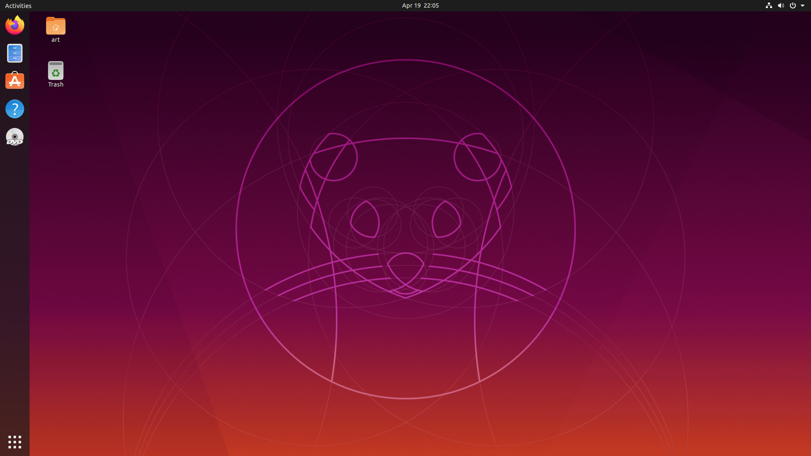
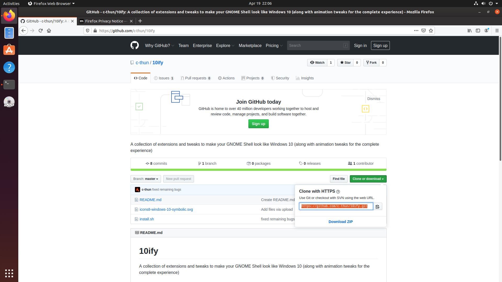
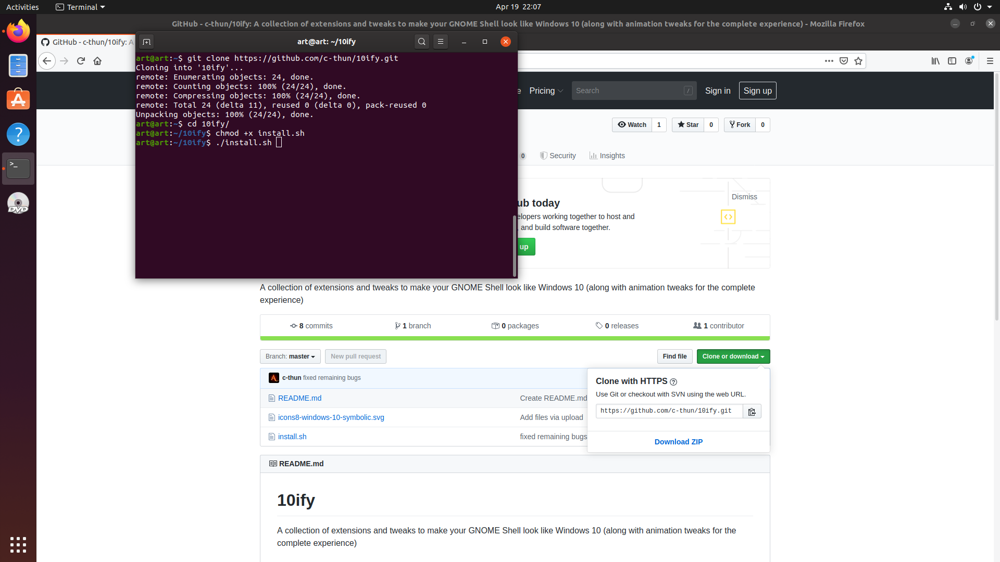
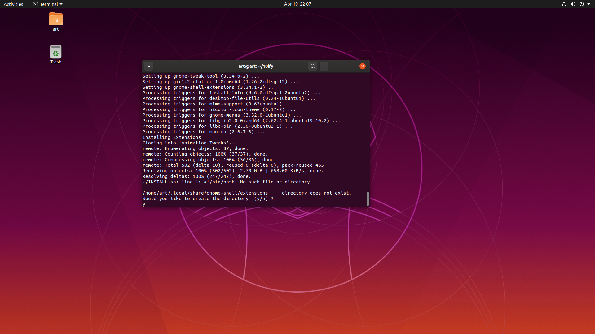
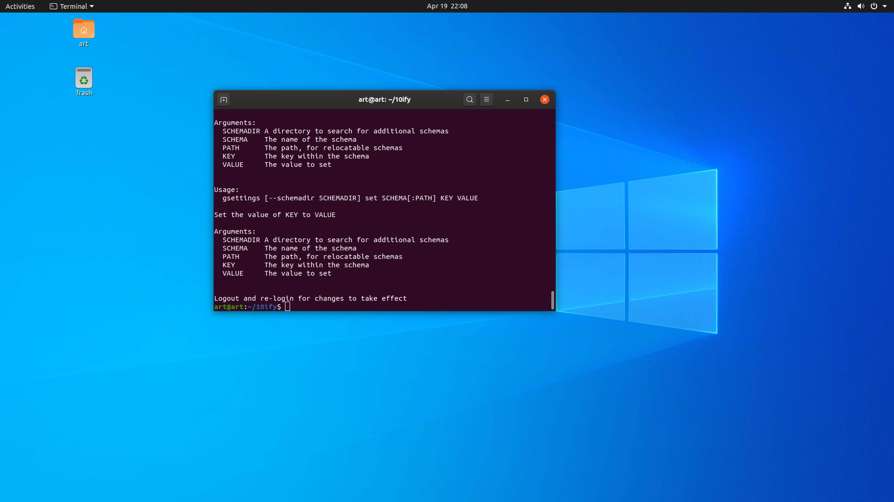
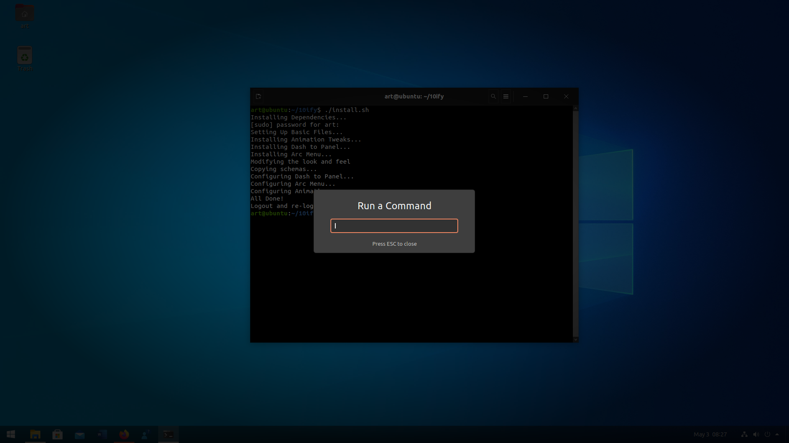
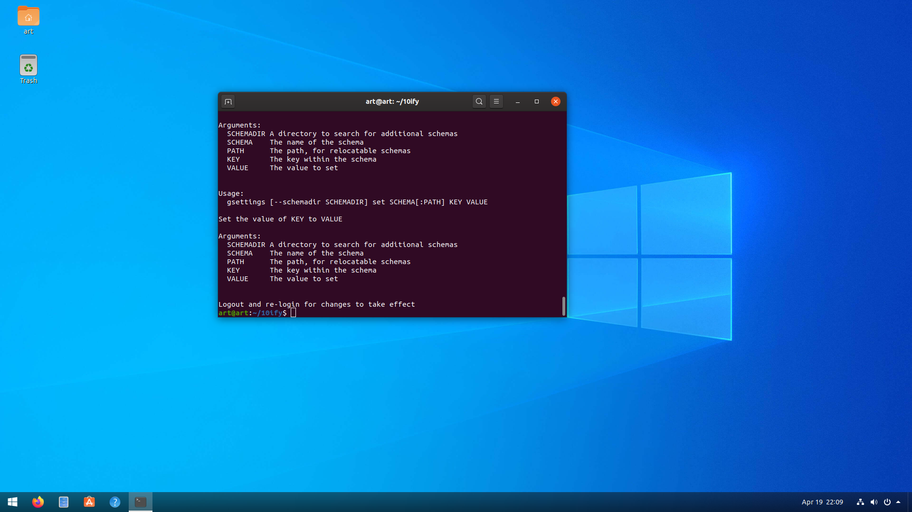
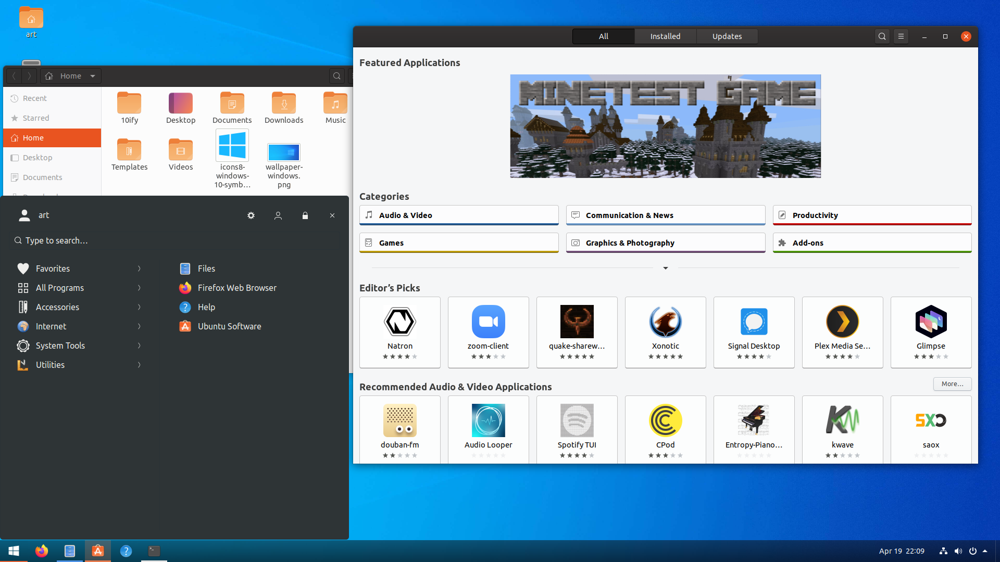

# 10ify
A collection of extensions and tweaks to make your GNOME Shell look like Windows 10 (along with animation tweaks for the complete experience). For more clarity on the steps, have a look at the Screenshots section beforehand

## Dependencies :
In order to run the script you need to install git. This can be done by -

``` sudo apt install git ```

## Setting Up : 

Now, go ahead and clone into the project, go inside the project directory and run the install script by using the following commands - 

``` git clone https://github.com/c-thun/10ify.git ``` 

``` cd 10ify ```

## Running the script : 
Finally, run the script using the following commands - 

``` chmod +x install.sh ```

``` ./install.sh ```

Do not run the last command under sudo and whenever it asks for password, input your sudo password as it will install dependencies. 

That's it! You will not see results instantly. Once the script has finished executing, simply logout and re-login to see the changes complete.
Alternately, if you are using an XOrg session (which is the default in Ubuntu), simply press Alt+F2 and in the dialog box that appears, press r. 

## Screenshots :
We start off with the original Ubuntu look...



Now, we follow the steps one by one as shown

#### Step 1 : Copy the repository link 



#### Step 2 : Type in all the commands one by one



#### Step 3 : Midway during the script you will be asked to confirm a change. Press 'y' to proceed with the changes



#### Step 4 : The script has completed! All you need to do now is either re-login (after logging out) or restart the shell by  pressing Alt+F2 and then typing in r



#### Step 4B : In case you decide to restart the shell by  pressing Alt+F2 and then typing in r, this is how it should look



#### Step 5 : All done! Enjoy your new Ubuntu experience 






