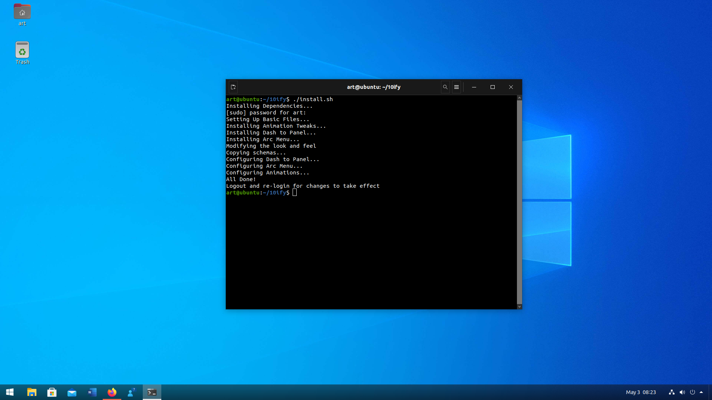

# 10ify
A collection of extensions and tweaks to make your GNOME Shell look like Windows 10 (along with animation tweaks for the complete experience). For more clarity on the steps, have a look at the Screenshots section beforehand. 

## Supported Operating Systems : 

This script supports the following operating systems - 
* Ubuntu 
* Ubuntu based distros : PopOS!, Linux Mint, etc.
* Fedora
* Debian

## Dependencies :

In order to run the script you need to install git. For Ubuntu, Ubuntu based distros and Debian users, this can be done by -

``` sudo apt install git ```

For Fedora users, this can be done by - 

``` sudo dnf install git ```

## Setting Up : 

Now, go ahead and clone into the project, go inside the project directory and run the install script by using the following commands - 

``` git clone https://github.com/c-thun/10ify.git ``` 

``` cd 10ify ```

## Running the script : 
Finally, run the script using the following commands - 

``` chmod +x install.sh ```

``` ./install.sh ```

Do not run the last command under sudo and whenever it asks for password, input your sudo password as it will install dependencies. 

That's it! You will not see results instantly. Once the script has finished executing, simply logout and re-login to see the changes complete.
Alternately, if you are using an XOrg session (which is the default in Ubuntu), simply press Alt+F2 and in the dialog box that appears, press r. 

If you wish to undo all the changes done by the install script, you can do so by running the following commands - 

``` chmod +x uninstall.sh ```

``` ./uninstall.sh ```

## Screenshots :

We start off with the original look...


Now, we follow the steps one by one as shown

#### Step 1 : Copy the repository link 


#### Step 2 : Type in all the commands one by one (depending on your OS)


#### Step 3 : Choose your theme! This will change your icons, shell, and application theme based on your choice. More themes will be added with time :)


#### Step 4 : Upon completion, you will see this dialogue. Click okay to proceed.


#### Step 5 : The script has completed! All you need to do now is either re-login (after logging out) or restart the shell by  pressing Alt+F2 and then typing in r (this only works in Xorg sessions, which Ubuntu uses by Default). Fedora and Debian use Wayland by default and thus cannot restart shell by this method. For Wayland users, the recommendation is to logout and re-login. 



#### Step 6 : In case you decide to restart the shell by  pressing Alt+F2 and then typing in r, this is how it should look


#### Step 7 : All done! Enjoy your new experience 


## Credits :

Due credits go to the following (none of the icons/styling belong to me and are used from the following sources) : 

* [B00merang-Project](https://github.com/B00merang-Project) for providing the shell and application themes. 
* [We10X Theme Creators](https://github.com/yeyushengfan258/We10X-icon-theme)
